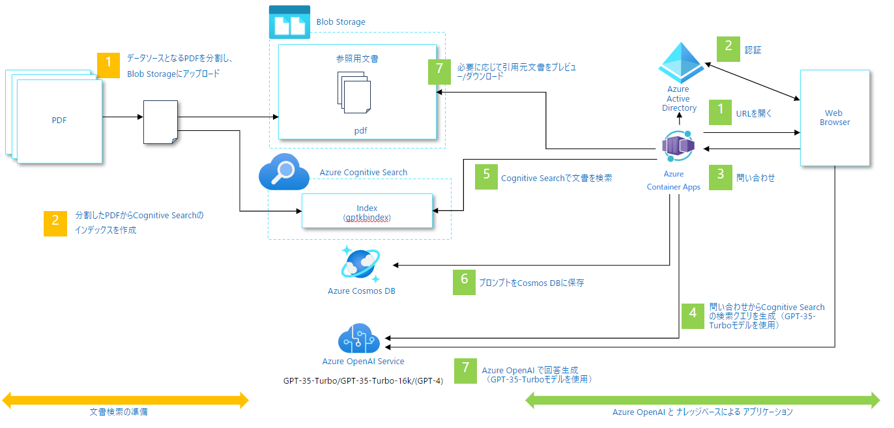

# Chat+社内文書検索

## 概要
このデモは、ChatGPT ライクなインターフェースを使用して企業の社内文書を検索するアプリケーションの実装パターンです。デモアプリを利用するためには、Azure OpenAI Service の ChatGPT(gpt-35-turbo) モデルと、Azure Cognitive Search、他にいくつかのリソースの作成が必要です。

このリポジトリでは、サンプルデータに[厚生労働省のモデル就業規則](https://www.mhlw.go.jp/stf/seisakunitsuite/bunya/koyou_roudou/roudoukijun/zigyonushi/model/index.html)を使用しています。

デモアプリは以下のように動作します。

## Architecture

## UI

